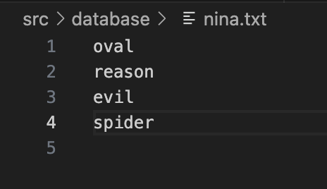
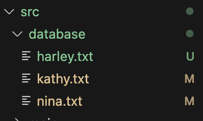
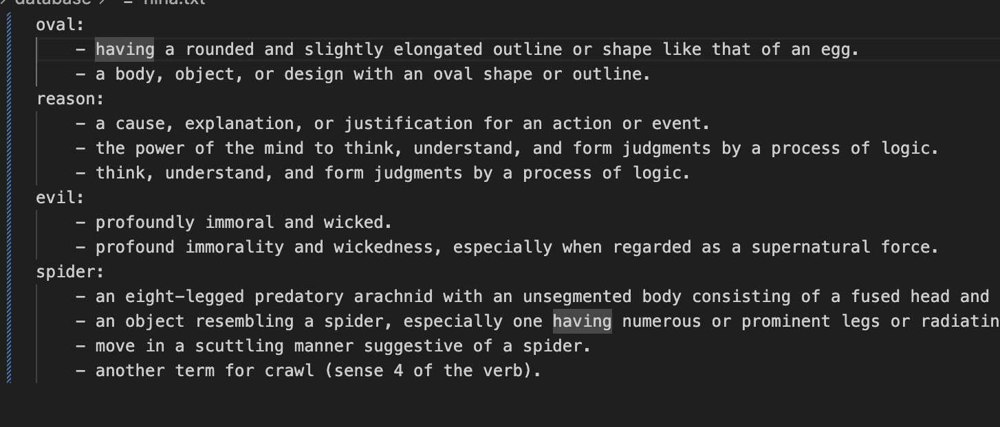
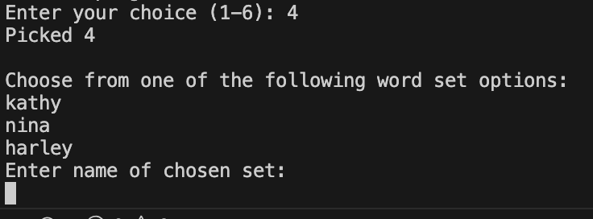

words-to-master
======================

A simple tool for improving english literacy.

## ``Limitations`` (please read)
* Need network connectivity
* Maximum of 100 word sets
* Maximum of 10000 words per set. (You need more?)

## Author
Big Gabe, find his facebook right here -> [https://www.facebook.com/mgabrielofficial]()

and also LinkedIn -> [https://www.linkedin.com/in/mgabrielofficial/]()

To see the tool on Github follow this link -> [https://github.com/marcial21/words-to-master]()

## Running the tool
This tool can be run using the following commands.
```
$ ./run.sh
```

## If 'permission denied' error from above comamnd
Run the following:
```
chmod +x run.sh; chmod +x removeCaches.sh
```

## Debugging the tool
When running the tool, there will be a `debug.log` that you can use to help narrow your search 


## Menu Option 2 - Import from database
To import your word sets, move text files (.txt) into the `/src/database/` directory.

You can simply open up finder and drag and drop into the /src/database/ folder for this project. Make sure its a text file. Meaning it must end with ``.txt``

Contents should look something like this: 


Don't add any extra characters, symbols, nuthin. It should be fine but I didn't do that much error checking. 

Anyway, after doing that, run the program and type ``2`` for importing. After a few seconds, or minutes depending on how many files and how many words are in the database folder the main menu will pop again where you can see all options. 

Now if you click option 4, you will be able to see all the lists that were imported. Take a look at the followng demonstration

### Demonstration
In this example I will use a file called ``nina.txt``. Take a look at the image above for what its contents. In my databaes directory I also have the following files: 


After hitting option 2, here are the contents of ``nina.txt``: 


And this is what we get if we hit option 4:


So you can choose those imported lists as the active set. And if you take look at the files in /database/ than all those text files will be updated with definitions. 

``Important``: Don't modify the format of the definitions it might mess stuff up. 

## Menu option 3 - Create a new list of words
Pretty self explanatory not gonna lie. Choose a name for your set. And just follow the instructions. 

## Menu option 4 - Choose from an existing list of words
You already saw this in the earlier section for importing sets. 

## Menu option 5 - Define a single word
Like option 3 and 4 but no text file is saved. 

## Menu option 6 - Exit program
Exits the program lol

# Testing
Um... unit tests are a work in progress...
